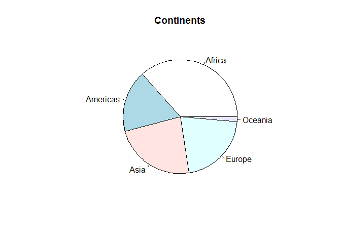
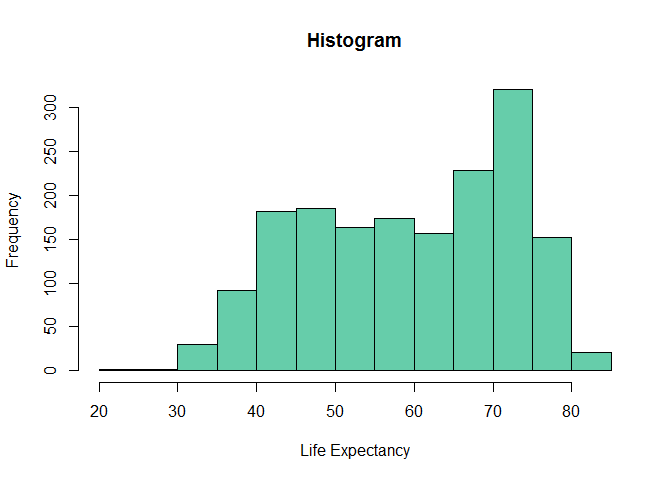
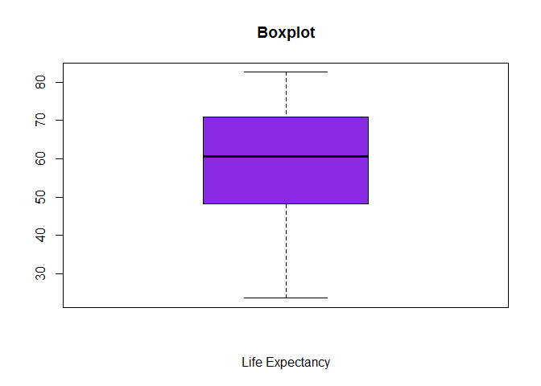
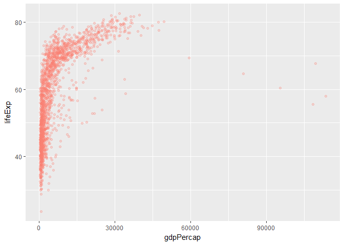
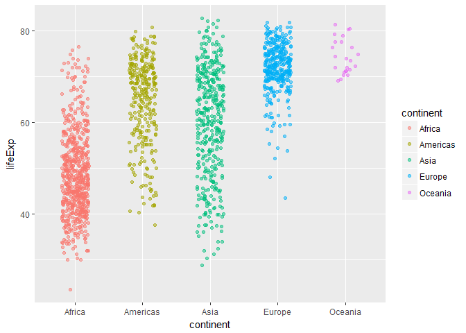
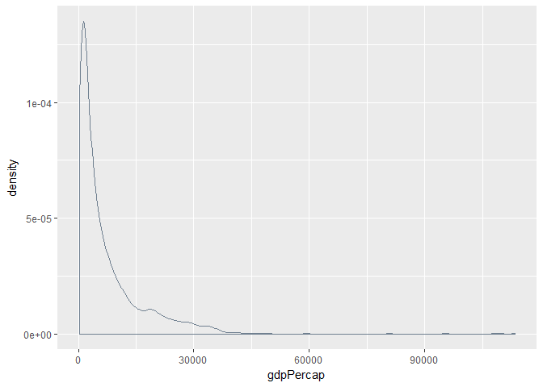

Welcome to my Stat 545 hw02 page. In this homework assignment, I will be exploring the gapminder dataset by using the dplyr package that we learned about during class.

First, I will load the packages I need:

```r
require(tidyverse)
```

```
## Loading required package: tidyverse
```

```
## Warning: package 'tidyverse' was built under R version 3.3.3
```

```
## Loading tidyverse: ggplot2
## Loading tidyverse: tibble
## Loading tidyverse: tidyr
## Loading tidyverse: readr
## Loading tidyverse: purrr
## Loading tidyverse: dplyr
```

```
## Warning: package 'ggplot2' was built under R version 3.3.2
```

```
## Warning: package 'tibble' was built under R version 3.3.2
```

```
## Warning: package 'tidyr' was built under R version 3.3.2
```

```
## Warning: package 'readr' was built under R version 3.3.3
```

```
## Warning: package 'purrr' was built under R version 3.3.3
```

```
## Warning: package 'dplyr' was built under R version 3.3.2
```

```
## Conflicts with tidy packages ----------------------------------------------
```

```
## filter(): dplyr, stats
## lag():    dplyr, stats
```

```r
require(gapminder)
```

```
## Loading required package: gapminder
```

```
## Warning: package 'gapminder' was built under R version 3.3.3
```

The gapminder dataset is <b>rectangular</b> data, which means, as far as I can surmise, that if you look at all of the data at once it literally is shaped like a rectangle.

Next, let's "smell test" the data to get a feel for what it is like.


```r
dim(gapminder)
```

```
## [1] 1704    6
```

```r
nrow(gapminder)
```

```
## [1] 1704
```

```r
ncol(gapminder)
```

```
## [1] 6
```

```r
is.data.frame(gapminder) #It appears that this is indeed a dataframe
```

```
## [1] TRUE
```

```r
is.vector(gapminder) # but not a vector
```

```
## [1] FALSE
```

```r
is.matrix(gapminder) # nor a matrix
```

```
## [1] FALSE
```

```r
is.list(gapminder) # It is also a list, because a dataframe is a list of lists
```

```
## [1] TRUE
```

```r
class(gapminder) 
```

```
## [1] "tbl_df"     "tbl"        "data.frame"
```

```r
# This command is probably more simple to use, but I like when R yells TRUE or FALSE at me. According to this function, the dataset consists of these classes:
#"tbl_df," "tbl" and "data.frame."

str(gapminder) 
```

```
## Classes 'tbl_df', 'tbl' and 'data.frame':	1704 obs. of  6 variables:
##  $ country  : Factor w/ 142 levels "Afghanistan",..: 1 1 1 1 1 1 1 1 1 1 ...
##  $ continent: Factor w/ 5 levels "Africa","Americas",..: 3 3 3 3 3 3 3 3 3 3 ...
##  $ year     : int  1952 1957 1962 1967 1972 1977 1982 1987 1992 1997 ...
##  $ lifeExp  : num  28.8 30.3 32 34 36.1 ...
##  $ pop      : int  8425333 9240934 10267083 11537966 13079460 14880372 12881816 13867957 16317921 22227415 ...
##  $ gdpPercap: num  779 821 853 836 740 ...
```

```r
# There are 1704 observation of 6 variables these variables have data types: 2 are factors, 2 are integers, and 2 are numeric.
summary(gapminder)
```

```
##         country        continent        year         lifeExp     
##  Afghanistan:  12   Africa  :624   Min.   :1952   Min.   :23.60  
##  Albania    :  12   Americas:300   1st Qu.:1966   1st Qu.:48.20  
##  Algeria    :  12   Asia    :396   Median :1980   Median :60.71  
##  Angola     :  12   Europe  :360   Mean   :1980   Mean   :59.47  
##  Argentina  :  12   Oceania : 24   3rd Qu.:1993   3rd Qu.:70.85  
##  Australia  :  12                  Max.   :2007   Max.   :82.60  
##  (Other)    :1632                                                
##       pop              gdpPercap       
##  Min.   :6.001e+04   Min.   :   241.2  
##  1st Qu.:2.794e+06   1st Qu.:  1202.1  
##  Median :7.024e+06   Median :  3531.8  
##  Mean   :2.960e+07   Mean   :  7215.3  
##  3rd Qu.:1.959e+07   3rd Qu.:  9325.5  
##  Max.   :1.319e+09   Max.   :113523.1  
## 
```
As shown, there are several ways to get information about the parameters of a dataset.
At this time, I do not see the value in all of these functions (there is a lot of redundance),
but I'm sure this will change as I become more familiar with R.

Now I will explore <u> one categorical variable and one numeric variable.</u>


```r
levels(gapminder$continent)
```

```
## [1] "Africa"   "Americas" "Asia"     "Europe"   "Oceania"
```

```r
# Interestingly, there are 5 levels of this variable:
# "Africa"   "Americas" "Asia"     "Europe"   "Oceania"

summary(gapminder$continent)
```

```
##   Africa Americas     Asia   Europe  Oceania 
##      624      300      396      360       24
```

Let's see if we can show this in graphical form:
<!-- -->

I should note that pie charts are not the best to use (they aren't as informative as barplots). But they're fun.

Now we can move on to a numeric variable.


```r
summary(gapminder$lifeExp)
```

```
##    Min. 1st Qu.  Median    Mean 3rd Qu.    Max. 
##   23.60   48.20   60.71   59.47   70.85   82.60
```

```r
  #  Min. 1st Qu.  Median    Mean 3rd Qu.    Max. 
  # 23.60   48.20   60.71   59.47   70.85   82.60 
```

<!-- -->

<!-- -->

From these graphs we can see the basic spread of the variable "lifeExp."

Now, let's explore this variable in more depth using ggplot2.
<!-- -->

Let's try something new and fancy.
<!-- -->

This variable follows a <u>Poisson</u> distribution:
<!-- -->

Next, I will play with select, filter, and piping.

What was the life expectancy for the continent <b>Oceania</b> in 1962?


```r
filter(gapminder, continent=="Oceania", year==1962)
```

```
## # A tibble: 2 × 6
##       country continent  year lifeExp      pop gdpPercap
##        <fctr>    <fctr> <int>   <dbl>    <int>     <dbl>
## 1   Australia   Oceania  1962   70.93 10794968  12217.23
## 2 New Zealand   Oceania  1962   71.24  2488550  13175.68
```


```r
filter(gapminder, lifeExp<70) %>% select(country,pop, lifeExp) %>%tail(10)
```

```
## # A tibble: 10 × 3
##     country      pop lifeExp
##      <fctr>    <int>   <dbl>
## 1  Zimbabwe  4277736  52.358
## 2  Zimbabwe  4995432  53.995
## 3  Zimbabwe  5861135  55.635
## 4  Zimbabwe  6642107  57.674
## 5  Zimbabwe  7636524  60.363
## 6  Zimbabwe  9216418  62.351
## 7  Zimbabwe 10704340  60.377
## 8  Zimbabwe 11404948  46.809
## 9  Zimbabwe 11926563  39.989
## 10 Zimbabwe 12311143  43.487
```

Piping is more simple than I expected, and is a huge quality of life improvement.


```r
filter(gapminder, continent=="Africa", pop>100000000) %>% select(country, pop, year) %>% head(3)
```

```
## # A tibble: 3 × 3
##   country       pop  year
##    <fctr>     <int> <int>
## 1 Nigeria 106207839  1997
## 2 Nigeria 119901274  2002
## 3 Nigeria 135031164  2007
```

Extra stuff from the hw page:

```r
filter(gapminder, country == c("Rwanda", "Afghanistan"))
```

```
## # A tibble: 12 × 6
##        country continent  year lifeExp      pop gdpPercap
##         <fctr>    <fctr> <int>   <dbl>    <int>     <dbl>
## 1  Afghanistan      Asia  1957  30.332  9240934  820.8530
## 2  Afghanistan      Asia  1967  34.020 11537966  836.1971
## 3  Afghanistan      Asia  1977  38.438 14880372  786.1134
## 4  Afghanistan      Asia  1987  40.822 13867957  852.3959
## 5  Afghanistan      Asia  1997  41.763 22227415  635.3414
## 6  Afghanistan      Asia  2007  43.828 31889923  974.5803
## 7       Rwanda    Africa  1952  40.000  2534927  493.3239
## 8       Rwanda    Africa  1962  43.000  3051242  597.4731
## 9       Rwanda    Africa  1972  44.600  3992121  590.5807
## 10      Rwanda    Africa  1982  46.218  5507565  881.5706
## 11      Rwanda    Africa  1992  23.599  7290203  737.0686
## 12      Rwanda    Africa  2002  43.413  7852401  785.6538
```

Something is wrong with the above code! It would be more appropriate to use the %in% command, which tells R to look for elements within the concatonated set.


```r
filter(gapminder, country %in% c("Rwanda", "Afghanistan"))
```

```
## # A tibble: 24 × 6
##        country continent  year lifeExp      pop gdpPercap
##         <fctr>    <fctr> <int>   <dbl>    <int>     <dbl>
## 1  Afghanistan      Asia  1952  28.801  8425333  779.4453
## 2  Afghanistan      Asia  1957  30.332  9240934  820.8530
## 3  Afghanistan      Asia  1962  31.997 10267083  853.1007
## 4  Afghanistan      Asia  1967  34.020 11537966  836.1971
## 5  Afghanistan      Asia  1972  36.088 13079460  739.9811
## 6  Afghanistan      Asia  1977  38.438 14880372  786.1134
## 7  Afghanistan      Asia  1982  39.854 12881816  978.0114
## 8  Afghanistan      Asia  1987  40.822 13867957  852.3959
## 9  Afghanistan      Asia  1992  41.674 16317921  649.3414
## 10 Afghanistan      Asia  1997  41.763 22227415  635.3414
## # ... with 14 more rows
```

This brings back twice as many values as the other code. It looks like R was doing something strange, like averaging the two countries together.

##Process

<li>This homework was simple (the in-class training was excellent, especially for dplyr), but it did take me a long time to complete.</li>
<li> I used my class notes a lot during this assignment </li>
<li> I also used some of the links from the Stat 545 website, including <a href="http://zevross.com/blog/2014/08/04/beautiful-plotting-in-r-a-ggplot2-cheatsheet-3/">this one.</a> </li>


